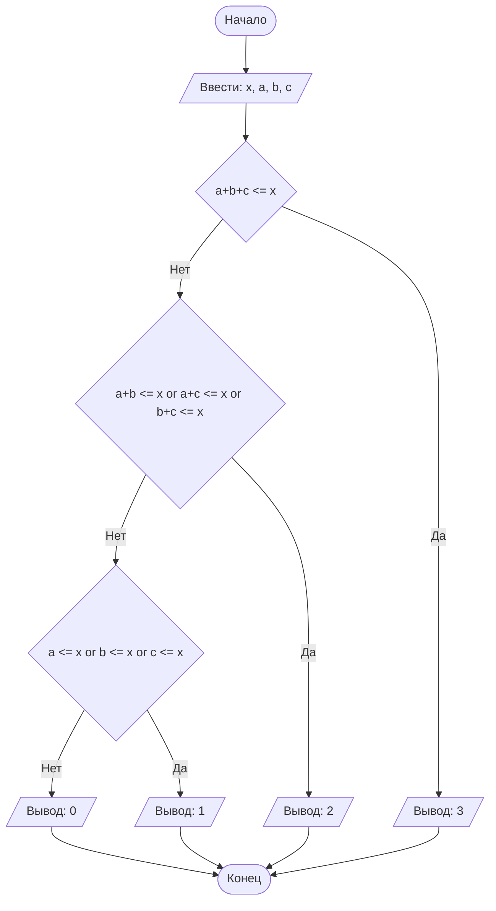

## Lab № 1

#### № группы: `ПМ-2502`

#### Выполнил: `Шаврин Радимир Вячеславович`

#### Вариант: `23`

### Cодержание:

- [Постановка задачи](#1-постановка-задачи)
- [Входные и выходные данные](#2-входные-и-выходные-данные)
- [Выбор структуры данных](#3-выбор-структуры-данных)
- [Алгоритм](#4-алгоритм)
- [Программа](#5-программа)
- [Анализ правильности решения](#6-анализ-правильности-решения)

### 1. Постановка задачи

> Программа получает на вход 4 натуральных числа x, a, b, c.
> Нужно вывести количество числел, сумма которых будет не больше чем x.

Эту задачу будем выполнять с помощью условновго оператора if, где сначала будем сравнивать сумму максимального количества чисел, а затем будем уменьшать это количество и сравнивать сумму меньшего количества чисел.

### 2. Входные и выходные данные

#### Данные на вход

Программа получает на вход 4 натуральных числа x, a, b, c.

|             | Тип                | min значение    | max значение   |
|-------------|--------------------|-----------------|----------------|
| x (Число 1) | Натуральное число | 1 | 2147483647 |
| a (Число 2) | Натуральное число | 1 | 2147483647 |
| b (Число 3) | Натуральное число | 1 | 2147483647 |
| c (Число 4) | Натуральное число | 1 | 2147483647 |

#### Данные на выход

Так как нужно вывести количество чиел, то на выводе будет целое число, болшее либо равно нулю.

|         | Тип                                | min значение | max значение   |
|---------|------------------------------------|--------------|----------------|
| Число 1 | Целое число | 0            | 2147483647 |

### 3. Выбор структуры данных

Программа получает 4 натуральных числа, не превышающих 2147483647. Поэтому для их хранения
можно выделить 4 переменных (`x`, `a`, `b` и `c`) типа `int`.

|             | название переменной | Тип (в Java) | 
|-------------|---------------------|--------------|
| X (Число 1) | `x`                 | `int`     |
| Y (Число 2) | `a`                 | `int`     | 
| X (Число 3) | `b`                 | `int`     |
| Y (Число 4) | `c`                 | `int`     | 

Для вывода результата необязательно его хранить в отдельной переменной.

### 4. Алгоритм

#### Алгоритм выполнения программы:

1. **Ввод данных:**  
   Программа считывает четыре натуральных числа, обозначенные как `x`, `a`, `b`, `c`.

2. **Сравнение чисел и вывод:**  
   Программа сначала сравнивает сумму всех трех чисел `a`, `b`, `c` с переменной `x`, если выполняется то выводится 3, если это не выполняется, то сравниваются два из чисел `a`, `b`, `c` с переменной `x`, если выполняется то выводится 2 далее, если это не выполняется, то сравниваются одно из чисел `a`, `b`, `c` с переменной `x`, если выполняется то выводится 1 далее, а если и это не выполняется, то выводится 0.


#### Блок-схема



### 5. Программа

```java
import java.io.PrintStream;
import java.util.Scanner;

public class Lab {
    public static Scanner in = new Scanner(System.in);
    public static PrintStream out = System.out;

    public static void main(String[] args) {
        int x = in.nextInt();
        int a = in.nextInt();
        int b = in.nextInt();
        int c = in.nextInt();

        if(a+b+c<=x){
            out.println(3);
        }
        else{
            if(a+b<=x || a+c<=x || b+c<=x){
                out.println(2);
            }
            else{
                if(a<=x || b<=x || c<=x){
                    out.println(1);
                }
                else{
                    out.println(0);
                }
            }
        }
    }
}
```

### 6. Анализ правильности решения

Программа работает корректно на всем множестве решений.

1. Тест на `a+b+c <= x`:

    - **Input**:
        ```
        10 1 2 3
        ```

    - **Output**:
        ```
        3
        ```

2. Тест на `a+b <= x or a+c <= x or b+c <= x`:

    - **Input**:
        ```
        10 10 5 4
        ```

    - **Output**:
        ```
        2
        ```
   - **Input**:
        ```
        10 6 10 4
        ```

    - **Output**:
        ```
        2
        ```
   - **Input**:
        ```
        10 65 1 1
        ```

    - **Output**:
        ```
        2
        ```

3. Тест на `a <= x or b <= x or c <= x`:

    - **Input**:
        ```
        10 12 34 1
        ```

    - **Output**:
        ```
        1
        ```
   - **Input**:
        ```
        10 12 10 18
        ```

    - **Output**:
        ```
        1
        ```
   - **Input**:
        ```
        10 3 12 45
        ```

    - **Output**:
        ```
        1
        ```

4. Тест на `a > x or b > x or c > x`:

    - **Input**:
        ```
        10 23 11 12
        ```

    - **Output**:
        ```
        0
        ```
